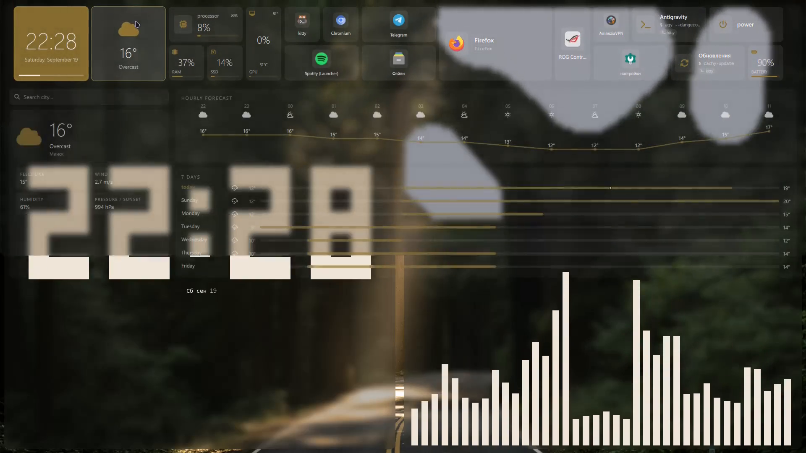

# 💠 Metro Shell

<div align="center">


<p align="center">
  <b>Live tiles and acrylic glass for Hyprland (Wayland), built on Quickshell + Qt 6.</b><br>
  Top-panel showcase, launcher, control center, settings, lockscreen and screenshot tool — from a single repo.
</p>

</div>

---

## 🎬 Video tour

<video src="assets/demo/metro-tour.mp4" controls poster="assets/demo/poster.png" width="100%"></video>

> GitHub doesn't always play `<video>` in READMEs — if the player won't open,
> download and watch the file directly: [`assets/demo/metro-tour.mp4`](assets/demo/metro-tour.mp4).



---

## ✨ Features

- 💎 **Metro & Glass**: blur, translucent surfaces, wallpaper-derived accent (Matugen, applied live with no restart), Segoe UI Variable / NotoSans Nerd Font, Papirus-Dark icons.
- 📊 **Live tiles**: clock + calendar, Open-Meteo weather (hourly/daily, city search), CPU / RAM (in GB) / GPU (NVIDIA/AMD/Intel + temperature) / battery (time left, ⚡) / SSD, media player, notes, photo frame.
- ⚡ **ExecWidget**: a tile for any shell command — in a terminal (kitty → alacritty → foot → gnome-terminal → xterm) or silently in the background, with a running indicator.
- ⭐ **Launcher**: pinned apps (`pinned.json`), search, `> command` — run in terminal, `= 2+2` — calculate.
- 🎛️ **Control center**: Wi-Fi / Bluetooth, volume and brightness, battery, notifications (mako). Opens from the right screen edge.
- 🖱️ **Screen edges**: top — tiles, left — launcher, right — control. Long-press (~0.8s) any tile for edit mode (drag, resize 1×1…3×2, delete, palette, "Compact" / "Reset" / "Done").
- 🎨 **Metro Settings**: wallpapers (including live ones), themes, icons, network, sound, display, power, windows, keyboard (binds editable from the GUI), notifications, updates (`metro-update`), language.
- 🔒 **Metro Lock**: custom lockscreen instead of hyprlock (hypridle locks after 5 min, `metro-lock` — manual).
- 📸 **Metro Shot**: `metro-shot` — toolbar (region/window/output, freeze via hyprpicker, OCR via tesseract, edit in Satty).

---

## 🛠️ Requirements

| Component | What you need |
| :--- | :--- |
| Compositor | Hyprland ≥ 0.56 (config is Lua: `hypr/hyprland.lua`) |
| UI engine | Quickshell ≥ 0.3.1 |
| Wallpapers | `awww` (built from source automatically outside Arch) |
| Fonts | NotoSans Nerd Font (installer downloads it); Segoe UI Variable is AUR-only, Qt falls back to a system font without it |
| Icons | `papirus-icon-theme` (installer offers Papirus-Dark) |

Utilities: `matugen` (palettes; via cargo where not packaged), `brightnessctl`, `pipewire`/`wireplumber` (`wpctl`), `playerctl`, `networkmanager`, `bluez`, `power-profiles-daemon`, `grim`/`slurp`/`wl-clipboard`, `satty`/`hyprpicker`/`tesseract` (optional), `mako`, `hypridle`, `kitty`, `nemo`, `ffmpeg`, `cliphist` (optional).

> On a desktop with no battery the BAT tiles show 0, with no backlight the brightness slider is inactive, with no BT/Wi-Fi those menus are empty. That's normal.
> NVIDIA only works via the proprietary driver (`nvidia-smi`); AMD/Intel go through sysfs.

---

## 🚀 Install

```bash
git clone https://github.com/banuee/metro-shell.git ~/metro-shell
cd ~/metro-shell
chmod +x install.sh
./install.sh
```

> ⚠️ Clone the repo **as your own user into your own `$HOME`**. Installing from
> someone else's home directory (e.g. `/home/banue` while testing as another
> user) cannot work — the installer stops with an explicit error in that case.

The installer detects your family and installs packages:

| Family | Manager | Quickshell | Notes |
| :--- | :--- | :--- | :--- |
| Arch / CachyOS / EndeavourOS / Manjaro | `pacman` + AUR (`paru`/`yay`, installs `yay` itself) | AUR | `ttf-segoe-ui-variable` from AUR |
| LFS on arch packages | `sudo sven sync` + `sudo sven install` (arch and AUR in one command) | `sven install quickshell` | updates go through **`sven-update`** (your own script: `sync+install` what's needed; `sudo sven update` breaks the system — never use it!) |
| Ubuntu / Debian / Mint / Pop!_OS | `apt` | PPA `avengemedia/danklinux` | stock repos often lack Hyprland — same PPA or a manual build; `awww` builds via cargo; `satty`/`hyprpicker` manually if wanted |
| Fedora / Nobara | `dnf` | COPR `errornointernet/quickshell` | same as Debian for the optional bits |

Everything else (openSUSE, Void, …) — manual mode: files are copied, the package list is shown.

What the installer does:
1. Installs dependencies + probes hardware (GPU/battery/backlight/BT/Wi-Fi) and re-checks binaries afterwards.
2. Backs up existing configs to `~/metro-backup/<date-time>`.
3. Places files: `~/.config/quickshell/metro{,-settings,-lock,-shot}`, `~/.local/bin/` (`qs-metro`, `metro-settings`, `metro-lock`, `metro-shot`, `metro-update`, `wall`, …), `~/.local/share/applications/`, `~/.config/hypr/hyprland.lua`, `~/.config/hypr/hypridle.conf`, `~/.config/mako/config`.
4. Copies stock wallpapers to `~/Wallpapers/` (yours are never touched) and builds the theme color from them — the shell matches the wallpaper out of the box. Default shell language is English (switch to Russian in Settings → Language).
5. Enables a systemd watcher for the single config (`metro-conf-watcher.path`) and runs `hyprctl reload` itself when inside a Hyprland session.
6. Logs live in `~/.local/state/metro/logs/` (per-user — `/tmp` breaks multi-user setups).

Kept as-is on update: `metro-shell.conf`, `layout.json`, `pinned.json`, `notes.json`, `city.json`. `hyprland.lua` is always refreshed from the repo; your differing one is saved next to it as `hyprland.lua.user-<date>`.

Flags:
```bash
./install.sh --check      # distro + hardware + what's missing (no changes)
./install.sh --deps-only  # dependencies only
./install.sh --no-deps    # files only
./install.sh --yes        # don't ask
./install.sh restore      # roll back from a backup
```

---

## ⌨️ Controls

Terminal:
- `qs-metro` — start / restart the shell
- `metro-settings` — settings
- `metro-lock` — lock the screen
- `metro-update` — system update (picks itself: `sven-update` → `cachy-update` → `pacman -Syu` → `apt upgrade` → `dnf upgrade` → `zypper dup`)
- `metro-shot [area|window|output|ocr|edit]` — screenshot
- `wall <file> | wall random` — wallpaper + theme recolor

Mouse: top edge — tiles, left — launcher, right — control.

Default binds (`SUPER` is the main mod):
- `SUPER+B / T / E` — firefox / kitty / nemo (the installer puts these everywhere)
- `Print`, `SUPER+Print`, `SUPER+Shift+S` — screenshot; `SUPER+L` — lockscreen
- `XF86Audio*` — `wpctl` volume/mute, `XF86MonBrightness*` — `brightnessctl`
- `SUPER+Q` — close window, `SUPER+Tab` / `SUPER+A/D/W/X` — navigation, `SUPER+LMB/RMB` mouse drag/resize
- `SUPER+N` — dwindle/master, `SUPER+V/F/Shift+F` — float/maximize/fullscreen
- `SUPER+1…9`, `ALT+1…9`, arrows, `ALT+Z` / `SUPER+I` — workspaces and scratchpads

`hyprland.lua` sets no monitors on purpose — Hyprland picks up your hardware itself (`hyprctl monitors`, example in the file comments). Add your own app binds below the stock ones following the pattern.

---

## 📂 Layout

```
metro-shell/
├── assets/
│   ├── demo/               # video tour (metro-tour.mp4 + poster.png)
│   └── wallpapers/         # stock out-of-the-box wallpaper (default.jpg)
├── bin/                    # qs-metro, metro-settings, metro-lock, metro-shot,
│                           # metro-update, metro-colors, metro-conf, wall, …
├── desktop/                # .desktop shortcuts
├── hypr/                   # hyprland.lua (Lua), hypridle.conf
├── lock/                   # Metro lockscreen
├── mako/                   # notifications
├── settings/               # settings app (12 sections)
├── shell/                  # main shell (TopPanel, LauncherPanel, …)
├── shot/                   # screenshot tool (quickshell UI)
├── systemd/                # metro-conf-watcher.path
├── install.sh
├── metro-shell.conf        # THE single config (theme/accent/panels/fonts/compositor)
└── README.md
```

Single config: edit `~/.config/quickshell/metro-shell.conf` (or the GUI) → `metro-conf apply` rebuilds the themes. "Remember"/"reset" buttons in settings snapshot via `metro-colors`.

---

## 📄 License

MIT. The `assets/demo/metro-tour.mp4` video and `assets/wallpapers/default.jpg` wallpaper are just the out-of-the-box showcase — replace them with your own in a fork.
