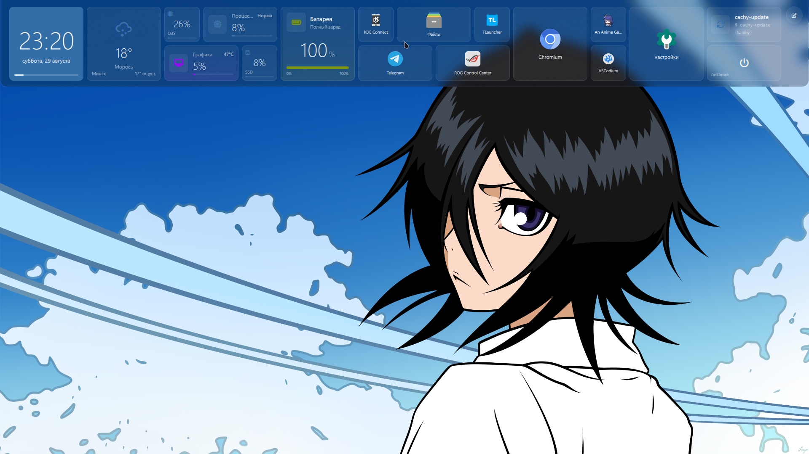
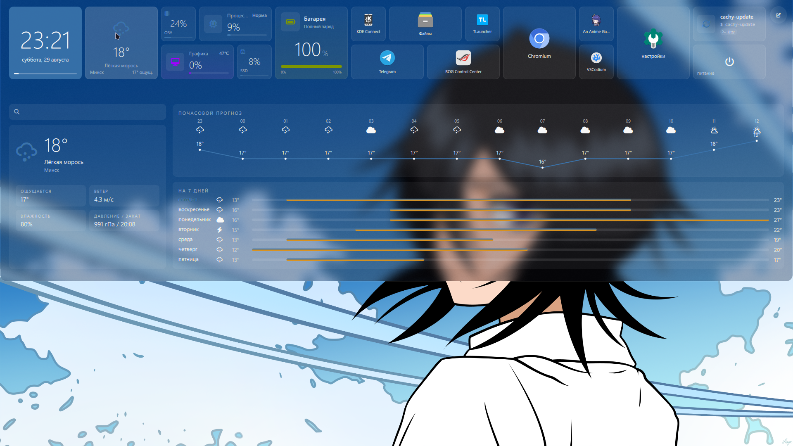
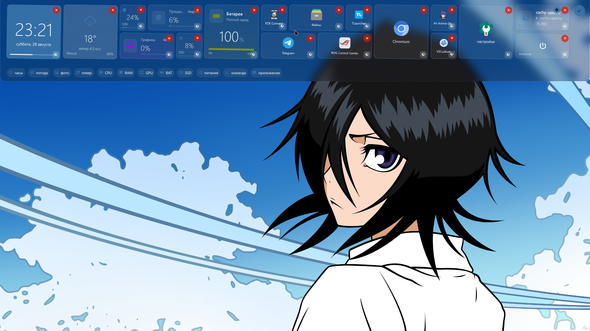
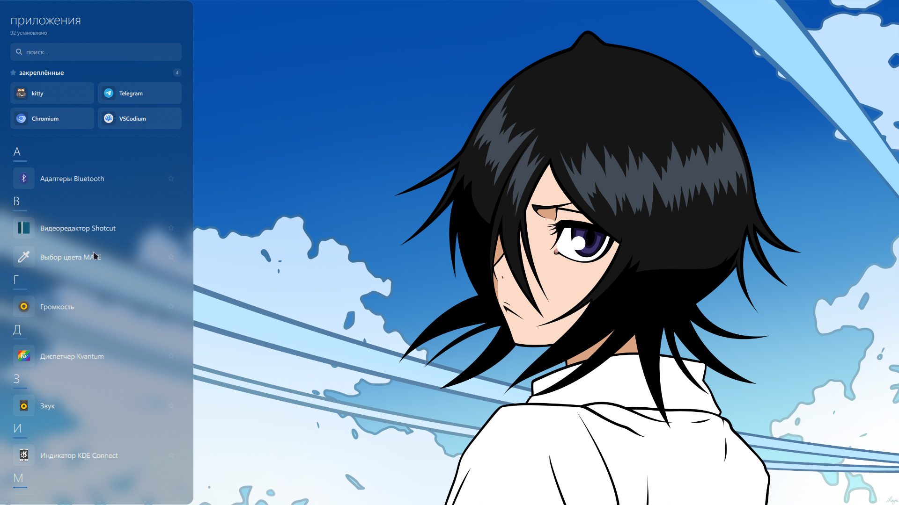
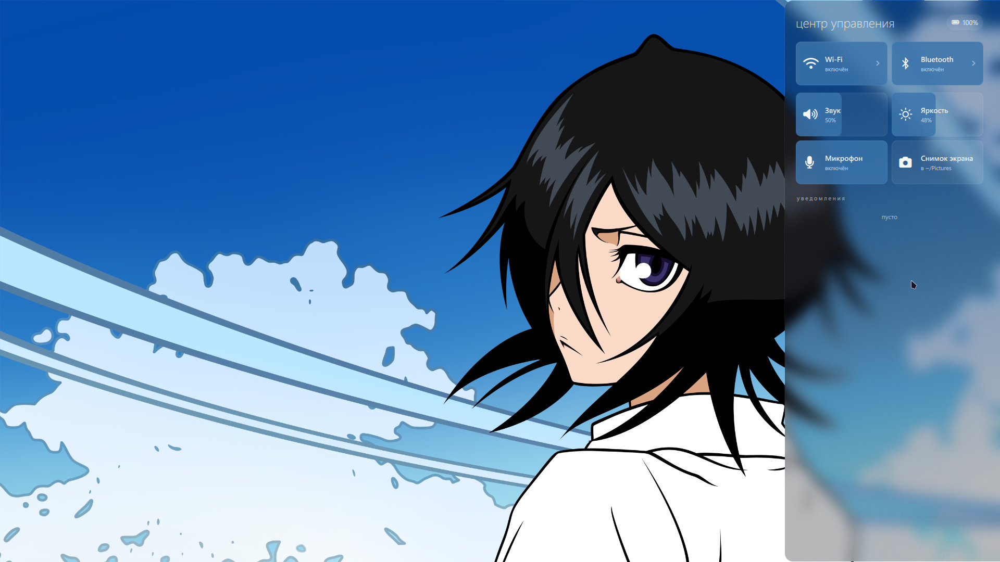
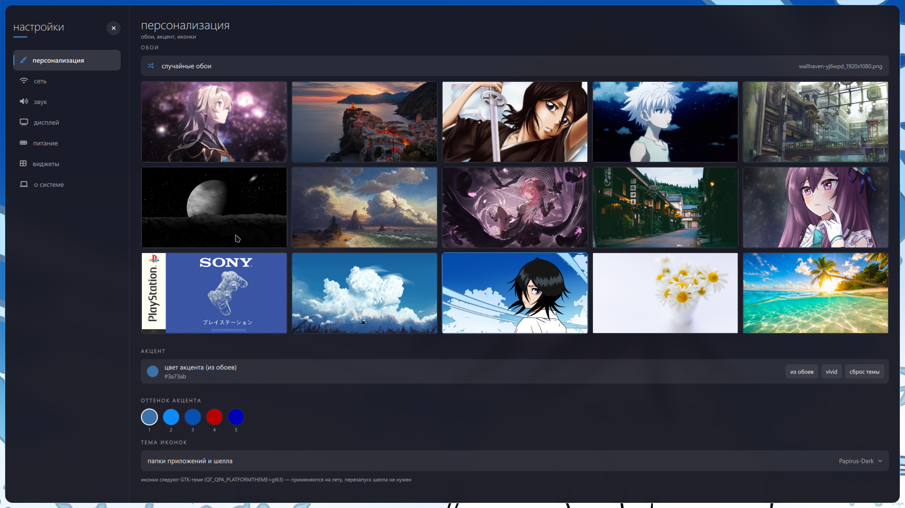

# 💠 Metro Shell

<div align="center">


<p align="center">
  <b>Современный, плавный и кастомизируемый рабочий шелл для Hyprland (Wayland), созданный на базе Quickshell и Qt 6.</b>
</p>

</div>

---

## 📸 Скриншоты

### 1. Верхняя панель и динамические плитки (Live Tiles)
> *Компактная акриловая панель с часами, погодой, системными метриками (CPU, ОЗУ в ГБ, GPU с температурой, АКБ, SSD), ярлыками приложений и виджетами команд.*



---

### 2. Раскрывающийся виджет погоды (Expandable Weather)
> *Почасовой график температуры Open-Meteo, 7-дневный прогноз с температурными полосами, метрики (ветер, давление, влажность, закат) и встроенный поиск городов.*



---

### 3. Режим редактирования и организация плиток
> *Интерактивный режим с анимацией покачивания (wiggling), удалением, быстрым добавлением виджетов и настройкой размеров 1×1, 2×1, 2×2.*



---

### 4. Лаунчер приложений и закреплённые (Favorites)
> *Выдвижная левая панель с секцией избранных приложений в 2 колонки, быстрым закреплением по звёздочке / ПКМ, алфавитным списком и мгновенным поиском.*



---

### 5. Центр управления и панель уведомлений
> *Быстрые переключатели Wi-Fi, Bluetooth, микрофона, скриншотов, плавные слайдеры громкости и яркости, индикатор батареи и история уведомлений.*



---

### 6. Центр настроек Metro Settings
> *Галерея обоев, динамическое извлечение акцентных палитр (Matugen), настройки тем иконок, параметров сети, звука, экрана и питания.*



---

## ✨ Особенности

- 💎 **Metro & Glass Дизайн**: Глубокий блюр, полупрозрачные подложки (`Theme.glass`), утончённая типографика (Segoe UI Variable / NotoSans Nerd Font) и гармоничные акцентные цвета.
- 📊 **Живые плитки телеметрии (SysW)**:
  - **CPU**: Загрузка процессора в реальном времени, цветовая индикация нагрузки и полоса активности.
  - **RAM**: Вычисление точного объёма занятой и общей памяти в гигабайтах (`3.5 / 14.9 GB`) и плавный трекер.
  - **GPU**: Утилизация графического ядра и температура (`NVIDIA / AMD / Intel`) с цветовым предупреждением.
  - **АКБ**: Интеллектуальная оценка времени работы, индикатор зарядки (`⚡`) и 4-уровневые глифы состояния батареи.
  - **SSD**: Отображение оставшегося свободного пространства и процента заполнения диска.
- ⚡ **Виджеты команд (ExecWidget)**:
  - Создание плиток для запуска любых bash-команд, утилит или скриптов.
  - Выбор режима: интерактивно в окне `kitty` (с сохранением вывода) или бесшумно в фоне.
  - Тактильная визуальная вспышка при клике и пульсирующая рамка во время фонового выполнения.
- ⭐ **Закреплённые приложения в лаунчере**:
  - Быстрый доступ к часто используемым программам в шапке левой панели.
  - Постоянное сохранение в `pinned.json`.
  - Управление закреплением через звёздочку или контекстный клик (ПКМ).
- 🎨 **Динамическая тема (Matugen)**:
  - Автоматическая генерация гармоничной палитры цветов из текущих обоев.
  - Применение на лету без необходимости перезапуска шелла или сессии.
- 🖱️ **Бесшовные триггеры краев экрана**:
  - Верхний край: открытие главной панели плиток.
  - Левый край: меню всех приложений и поиск.
  - Правый край: Центр управления и уведомления.

---

## 🛠️ Системные требования и зависимости

### Основные компоненты
- **Wayland-композитор**: [Hyprland](https://hyprland.org/)
- **UI Движок**: [Quickshell](https://git.outfoxxed.me/outfoxxed/quickshell) (`>= 0.3.1`)
- **Шрифты**: `ttf-segoe-ui-variable` (AUR), `ttf-noto-nerd` / `Symbols Nerd Font`
- **Тема иконок**: `papirus-icon-theme`

### Системные утилиты
| Пакет | Назначение |
| :--- | :--- |
| `matugen` | Генерация цветовых палитр из обоев |
| `brightnessctl` | Управление яркостью экрана |
| `pipewire`, `wireplumber` | Управление громкостью и аудиоустройствами |
| `playerctl` | Управление воспроизведением медиа |
| `networkmanager`, `bluez` | Интеграция сети и Bluetooth |
| `power-profiles-daemon` | Переключение профилей питания |
| `grim`, `slurp`, `wl-clipboard` | Создание скриншотов и буфер обмена |
| `mako` | Демон уведомлений |
| `hypridle` | Контроль блокировки и сна экрана |

---

## 🚀 Установка

В репозиторий включен интерактивный скрипт установки, который автоматически проверит и установит зависимости, сделает резервную копию существующих конфигураций и настроит шелл.

```bash
git clone https://github.com/your-username/metro-shell.git ~/metro-shell
cd ~/metro-shell
chmod +x install.sh
./install.sh
```

### Автоматические действия установщика:
1. Определение пакетного менеджера (`pacman`, `yay`, `paru`) и установка необходимых пакетов и шрифтов.
2. Создание резервной копии текущих конфигов в `~/metro-backup/`.
3. Установка компонентов в:
   - `~/.config/quickshell/metro` — основной шелл и виджеты
   - `~/.config/quickshell/metro-settings` — приложение настроек
   - `~/.config/quickshell/metro-lock` — экран блокировки
   - `~/.local/bin/` — вспомогательные утилиты управления (`qs-metro`, `metro-settings`, `metro-lock`, `wall`)
   - `~/.local/share/applications/` — ярлыки рабочего стола

### Восстановление из бэкапа
Если вы захотите вернуть предыдущие конфигурации:
```bash
./install.sh restore
```

---

## ⌨️ Управление и горячие клавиши

### Быстрые команды терминала
- `qs-metro` — запуск / перезапуск основного шелла.
- `metro-settings` — открыть окно настроек персонализации и системы.
- `metro-lock` — заблокировать экран с анимацией Metro.
- `wall /path/to/image.png` — установить новые обои и автоматически пересчитать акцентную тему.

### Жесты и мышь
- **Подведение мыши к верхнему краю экрана**: открывает панель Live Tiles.
- **Подведение мыши к левому краю экрана**: открывает меню приложений (Launcher).
- **Подведение мыши к правому краю экрана**: открывает Центр управления (Control Center).
- **Клик по кнопке «Карандаш» (в правом верхнем углу панели)**: переход в режим редактирования сетки виджетов.

---

## 📂 Структура проекта

```
metro-shell/
├── assets/
│   └── screenshots/        # Скриншоты интерфейса
├── bin/                    # Скрипты запуска и CLI-утилиты
│   ├── metro-colors        # Генератор цветов Matugen
│   ├── metro-lock          # Запуск экрана блокировки
│   ├── metro-settings      # Запуск окна настроек
│   ├── qs-metro            # Контроллер демона Quickshell
│   └── wall                # Смена обоев
├── desktop/                # .desktop файлы для интеграции в меню
├── hypr/                   # Конфигурации Hyprland и Hypridle
├── lock/                   # Экран блокировки Metro LockScreen
├── mako/                   # Конфигурация всплывающих уведомлений
├── settings/               # Приложение настроек Metro Settings
├── shell/                  # Основной QML-код рабочего шелла
│   ├── TopPanel.qml        # Верхняя панель и динамическая сетка виджетов
│   ├── LauncherPanel.qml   # Меню приложений с закреплёнными
│   ├── RightPanel.qml      # Центр управления и слайдеры
│   ├── ExecWidget.qml      # Виджет выполнения шелл-команд
│   ├── Weather.qml         # Модуль интеграции погоды Open-Meteo
│   └── Theme.qml           # Цветовые токены, шрифты и стили
├── install.sh              # Интерактивный инсталлятор
└── README.md               # Документация проекта
```

---

## 📄 Лицензия

Проект распространяется под лицензией **MIT**. Подробности в файле `LICENSE`.
